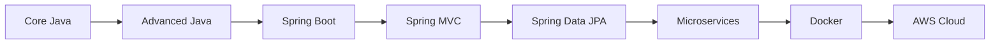
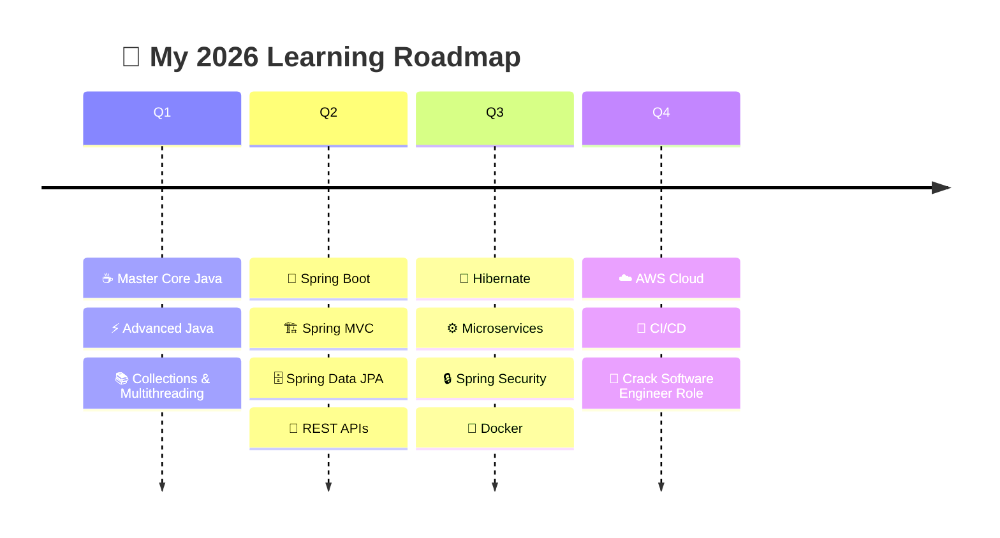
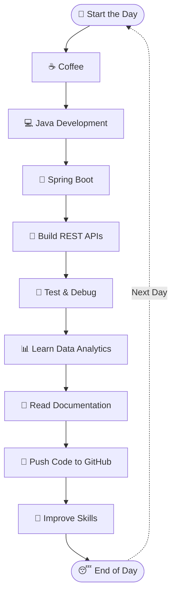
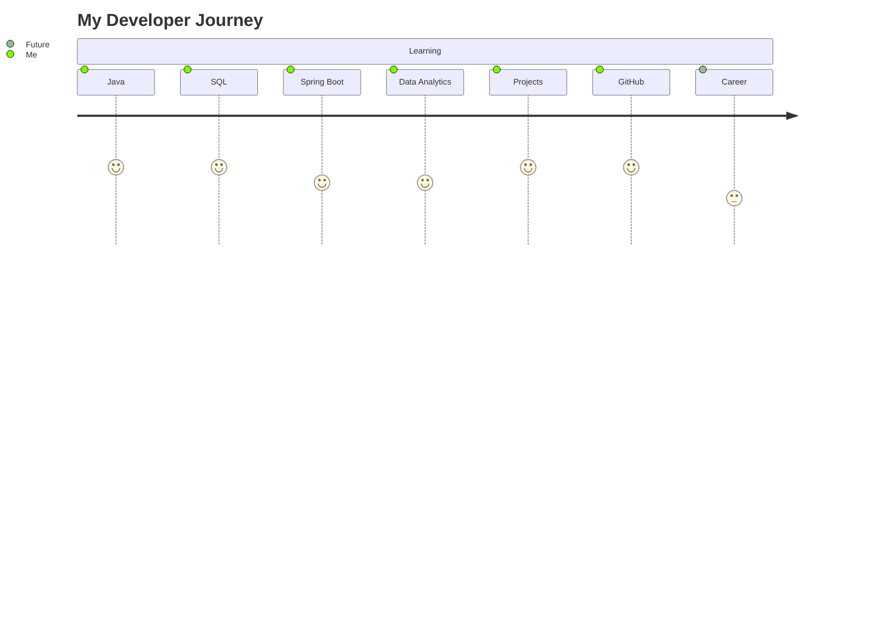

<div align="center">


<br>


</div>

---
<details>
<summary>📚 Click to View My Skills</summary>

<br>

- ☕ Java
- 🌱 Spring Boot
- 🗄️ MySQL
- 🌐 HTML
- 🎨 CSS
- ⚡ JavaScript
- 🔧 Git & GitHub

</details>


# 💫 About Me

<div align="center">


</div>

### 👨‍💻 Who Am I?

- 🔭 Working on **Full Stack Java Projects**
- 🌱 Currently learning **Spring Boot, React & Microservices**
- 💡 Interested in **Frontend + Backend Development**
- ⚡ Love creating **Premium UI Designs**
- 🎯 Goal: Become a **Top Software Engineer**
- 🚀 Exploring **Modern Web Technologies**
- 💬 Ask me about **Java, SQL, Spring Boot, React**
- 📚 Student at **Naresh i Technologies**

<br><br>

---

# 🌐 Connect With Me

<div align="center">

<a href="https://github.com/SUBHAM149">

</a>

<a href="https://linkedin.com">

</a>

<a href="mailto:yourmail@gmail.com">

</a>

<a href="https://instagram.com">

</a>

</div>

---

# 🚀 Tech Stack

<div align="center">


</div>

---

# 📊 GitHub Analytics


<div align="center">


</div>

---

# 📈 Contribution Graph

<div align="center">


</div>

---

# 🏆 GitHub Achievements

<div align="center">


</div>


---


# ⚡ Featured Skills

<div align="center">

| 💻 Frontend | ⚙️ Backend | 🛢️ Database | 🛠️ Tools |
|-------------|------------|-------------|-----------|
| HTML5 | Java | MySQL | Git |
| CSS3 | Spring Boot | Oracle SQL | GitHub |
| JavaScript | JDBC | MongoDB | VS Code |
| React JS | REST APIs | PostgreSQL | Maven |
| Bootstrap | Hibernate | Firebase | Postman |

</div>

---

# 🐍 Contribution Snake

<div align="center">


</div>

---

# ✨ Random Dev Quote

<div align="center">


</div>

---


# 🔥 Fun Fact

<div align="center">

```diff
+ I love building cool websites 🚀
+ Coffee + Coding = Perfect Combo ☕
+ Always learning new technologies 💡
````

</div>

---

<div align="center">


# ✨ Thanks For Visiting My Profile ✨

### ⭐ Don't Forget To Follow & Star Repositories ⭐

<div align="center" dir="auto">

## 📊 GitHub Statistics

<div align="center" dir="auto">


<br/>
<br/>

<br/>
<br/>


</div>

---

## 🏆 Unlocked Achievements

<div align="center" dir="auto">

</div>

<br/>

<div align="center" dir="auto">
  <code>🏆 TROPHY_CASE: FULL_WIDTH / MAXIMUM_GLORY 🏆</code>
</div>

---

## 🔗 Connect With Me

<br/>

<a href="https://github.com/SUBHAM149">
  
</a>
<a href="https://t.me/SUBHAM">
  
</a>
<a href="https://www.linkedin.com/in/SUBHAM">
  
</a>
<a href="https://www.instagram.com/SUBHAM">
  
</a>
<a href="https://SUBHAM149.github.io/About-Me/">
  
</a>

<br/><br/>


<br/><br/>

</div>

---

<div align="center" dir="auto">

## 👾 PAC-MAN Contributions

<picture>
  <source media="(prefers-color-scheme: dark)" srcset="https://raw.githubusercontent.com/HamiParsa/HamiParsa/output/pacman-contribution-graph-dark.svg">
  <source media="(prefers-color-scheme: light)" srcset="https://raw.githubusercontent.com/HamiParsa/HamiParsa/output/pacman-contribution-graph.svg">
  
</picture>

</div>

</div>

```

```
---
     <!-- =============================================================================== ANOTHER README ===============================================================================-->
<div align="center">
<br>ANOTHER README<br>
</div>
<div align="center">


<p align="center">
  
</p>

<p align="center">

  

  

  

  

  

  

  

  

  

  

  

  

  

  

</p>

<br/>

<div align="center">


</div>
<br/>

<table>
<tr>
<td width="60%" valign="top">

### 🧭 About Me

Hi, I'm **Subham Behera** 👋

I'm a passionate **Java Full Stack Developer** and **Data Analytics Enthusiast** who enjoys building scalable, secure, and user-friendly applications from the ground up.

My expertise focuses on developing modern web applications using **Java, Spring Boot, Spring MVC, Hibernate, REST APIs, MySQL, Oracle SQL, HTML, CSS, JavaScript, and Python**.

Alongside software development, I'm expanding my knowledge in **Data Analytics**, working with **Python, SQL, Excel, Pandas, NumPy, and Power BI** to transform raw data into meaningful insights and support data-driven decision-making.

### 🚀 What I Do

- **Java Full Stack Development** — Building enterprise-grade web applications using Java, Spring Boot, Spring MVC, Hibernate, and RESTful APIs.
- **Backend Development** — Designing scalable REST APIs, integrating databases, and implementing clean architecture.
- **Data Analytics** — Performing data analysis, visualization, and reporting using Python, SQL, Excel, and Power BI.
- **Database Management** — Working with MySQL and Oracle Database for efficient data storage and retrieval.
- **Continuous Learning** — Exploring new technologies, contributing to GitHub projects, and improving problem-solving skills through hands-on development.

Currently, I'm focused on strengthening my expertise in **Java Full Stack Development**, **Spring Boot Microservices**, and **Data Analytics**, while building real-world projects that solve practical problems.

I believe in writing **clean, maintainable, and efficient code**, continuously learning new technologies, and growing into a highly skilled **Software Engineer**.

</td>
<td width="40%" valign="top" align="center">


</td>
</tr>
</table>

---

### 🎯 Currently Focused On

| 🚀 Area | 📌 What I'm Learning & Building |
|:---|:---|
| ☕ **Java Development** | Mastering Core Java, Advanced Java, Collections & Multithreading |
| 🌱 **Spring Ecosystem** | Building scalable applications with Spring Boot, Spring MVC, Spring Data JPA & Hibernate |
| 🔗 **Backend Development** | Developing secure RESTful APIs, CRUD applications & Microservices |
| 💾 **Database** | Designing and optimizing MySQL & Oracle SQL databases |
| 🌐 **Frontend** | Creating responsive interfaces using HTML, CSS, JavaScript & Bootstrap |
| 📊 **Data Analytics** | Analyzing data with Python, SQL, Excel, Pandas & Power BI |
| 🛠️ **Tools & DevOps** | Git, GitHub, Maven, Postman & Eclipse IDE |
| 🚀 **Projects** | Building real-world Java Full Stack and Data Analytics projects |
| 🌟 **Open Source** | Enhancing GitHub portfolio and contributing to open-source projects |

<br/>

---

### 🛠️ Tech & Tools

<div align="center">

## ☕ Languages


<br><br>

## 🌱 Java Full Stack


<br><br>

## 💾 Database


<br><br>

## 📊 Data Analytics


<br><br>

## 🛠️ Tools


</div>

**📊 Data Analytics**


<br><br>

**🛠️ Development Tools**


<br><br>

**📚 Currently Learning**


</div>

---

## 🤝 Let's Connect

<div align="center">

<a href="mailto:YOUR_EMAIL@gmail.com" target="_blank">

</a>

<a href="https://www.linkedin.com/in/YOUR-LINKEDIN/" target="_blank">

</a>

<a href="https://github.com/SUBHAM149" target="_blank">

</a>

<a href="https://x.com/YOUR_USERNAME" target="_blank">

</a>

<a href="https://www.instagram.com/YOUR_USERNAME/" target="_blank">

</a>

</div>

---

## 📊 GitHub Profile Views

<div align="center">


<br><br>


</div>

---

<div align="center">

### ⭐ Thanks for visiting my profile!

*"Code with Passion • Build with Purpose • Learn without Limits"* 🚀


</div>


 <!-- =============================================================================== ANOTHER README ===============================================================================-->
<div align="center">
<br>ANOTHER README<br>
</div>
<br>
<table>
<tr>

<td width="60%" valign="top">

# 👋 Hi, I'm Subham Behera

💻 **Java Full Stack Developer** | 📊 **Data Analytics Enthusiast**

🎓 Passionate about building scalable, secure, and user-friendly web applications using modern Java technologies.

### 🚀 Currently Learning

- ☕ Core Java & Advanced Java
- 🌱 Spring Boot, Spring MVC & Spring Data JPA
- 🔗 REST APIs & Hibernate
- 💾 MySQL & Oracle SQL
- 📊 Python, SQL, Excel & Power BI
- 🌐 HTML, CSS, JavaScript & Bootstrap

### 🎯 Career Goal

Become a highly skilled **Software Engineer** specializing in **Java Full Stack Development**, **Cloud Technologies**, and **Data Analytics**.

### 📍 Quick Info

- 🌍 **Location:** India
- 💼 **Open to:** Internships & Full-Time Opportunities
- 📚 **Currently Exploring:** Microservices & Spring Security
- 🚀 **Portfolio:** Real-World Java Full Stack Projects
- ⚡ **Fun Fact:** I enjoy turning ideas into real-world applications.

</td>

<td width="40%" align="center">


<br><br>


<br>


<br>


<br>


<br><br>


<br>


</td>

</tr>
</table>
## 💼 What I Do

<table>
<tr>

<td align="center" width="25%">

### ☕ Backend

Building scalable backend applications using **Java**, **Spring Boot**, **Spring MVC**, **Hibernate**, and **REST APIs**.

</td>

<td align="center" width="25%">

### 🌐 Frontend

Creating responsive and modern interfaces with **HTML**, **CSS**, **JavaScript**, and **Bootstrap**.

</td>

<td align="center" width="25%">

### 💾 Database

Working with **MySQL**, **Oracle SQL**, and **MongoDB** to design efficient databases.

</td>

<td align="center" width="25%">

### 📊 Analytics

Analyzing data using **Python**, **SQL**, **Excel**, **Pandas**, and **Power BI**.

</td>

</tr>
</table>
## 🚀 My Expertise

```text
☕ Java Development          ████████████████████ 95%

🌱 Spring Boot              ██████████████████░ 90%

💾 MySQL                    █████████████████░░ 88%

🔗 REST APIs                █████████████████░░ 90%

🌐 HTML & CSS               ███████████████████░ 92%

⚡ JavaScript               ████████████████░░░ 80%

🐍 Python                   ████████████████░░░ 82%

📊 Power BI                 ██████████████░░░░░ 75%
```
## 🏆 Highlights

🏅 Built multiple Java Full Stack projects

🏅 Developed RESTful APIs using Spring Boot

🏅 Hands-on experience with Spring Data JPA & Hibernate

🏅 Created interactive dashboards using Power BI

🏅 Strong understanding of MySQL & Oracle SQL

🏅 Passionate about Clean Code & Software Design
## 🌟 Services

| 💻 Development | 📊 Analytics | 🚀 Deployment |
|---------------|-------------|---------------|
| Java Applications | Power BI Dashboards | GitHub |
| Spring Boot APIs | SQL Analysis | Maven |
| CRUD Applications | Python Analytics | Postman |
| MVC Applications | Excel Reports | Eclipse |

## 📚 Currently Exploring



---

# 🚀 2026 Roadmap

<div align="center">


</div>



> **"Small improvements every day lead to remarkable results."** 🚀

---

# ⚡ My Daily Workflow

<div align="center">


</div>



<div align="center">

### 💡 Developer Mantra

> **Code • Learn • Build • Share • Repeat** 🚀

</div>

---

## 💡 Coding Philosophy

<div align="center">


</div>

---

### 🌟 Principles

```text
✓ Write Clean Code

✓ Keep Learning

✓ Build Real Projects

✓ Solve Real Problems

✓ Never Stop Improving
```

---

> "Code is like humor. When you have to explain it, it's bad."

> — Cory House

---

> "Programs must be written for people to read."

> — Harold Abelson

## 🏆 Journey


## ✨ Profile Highlights

<div align="center">


</div>
<div align="center">

# 🚀 "Code. Learn. Build. Repeat."


</div>


<h2 align="center">🚀 2026 Roadmap</h2>

<p align="center">


</p>

<table align="center">

<tr>

<th>🌱 Quarter 1</th>

<th>🚀 Quarter 2</th>

<th>⚙️ Quarter 3</th>

<th>☁️ Quarter 4</th>

</tr>

<tr>

<td>

✅ Core Java<br>
✅ Advanced Java<br>
✅ Collections<br>
✅ Multithreading

</td>

<td>

🌱 Spring Boot<br>
🏗 Spring MVC<br>
🗄 Spring Data JPA<br>
🔗 REST APIs

</td>

<td>

💾 Hibernate<br>
🔒 Spring Security<br>
⚙️ Microservices<br>
🐳 Docker

</td>

<td>

☁️ AWS Cloud<br>
🚀 CI/CD<br>
📦 Deployment<br>
💼 Software Engineer

</td>

</tr>

</table>

---

<div align="center">

> **"Small improvements every day lead to remarkable results."** 🚀

</div>
<h2 align="center">⚡ My Daily Workflow</h2>

<table align="center">

<tr>

<td align="center">

🌅

<br>

<b>Wake Up</b>

</td>

<td align="center">

➡️

</td>

<td align="center">

☕

<br>

<b>Coffee</b>

</td>

<td align="center">

➡️

</td>

<td align="center">

💻

<br>

<b>Code</b>

</td>

<td align="center">

➡️

</td>

<td align="center">

📚

<br>

<b>Learn</b>

</td>

<td align="center">

➡️

</td>

<td align="center">

🚀

<br>

<b>Build</b>

</td>

<td align="center">

➡️

</td>

<td align="center">

🌍

<br>

<b>GitHub</b>

</td>

<td align="center">

➡️

</td>

<td align="center">

😴

<br>

<b>Sleep</b>

</td>

</tr>

</table>

<div align="center">

### 🔁 Repeat Every Day

☕ ➜ 💻 ➜ 📚 ➜ 🚀 ➜ 🌍 ➜ 😴

</div>
<h2 align="center">💡 Coding Philosophy</h2>

<p align="center">


</p>

<table align="center">

<tr>

<td align="center">

🧹

<br>

<b>Clean Code</b>

</td>

<td align="center">

📚

<br>

<b>Keep Learning</b>

</td>

<td align="center">

🚀

<br>

<b>Build Projects</b>

</td>

<td align="center">

🧠

<br>

<b>Solve Problems</b>

</td>

<td align="center">

⭐

<br>

<b>Improve Daily</b>

</td>

</tr>

</table>

> **"Programs must be written for people to read."** — Harold Abelson

> **"First, solve the problem. Then, write the code."** — John Johnson
> <h2 align="center">🏆 Developer Journey</h2>

<table align="center">

<tr>

<th>Technology</th>

<th>Progress</th>

</tr>

<tr>

<td>☕ Java</td>

<td>██████████████████ 95%</td>

</tr>

<tr>

<td>🌱 Spring Boot</td>

<td>████████████████ 90%</td>

</tr>

<tr>

<td>💾 MySQL</td>

<td>███████████████ 88%</td>

</tr>

<tr>

<td>🔗 REST APIs</td>

<td>███████████████ 90%</td>

</tr>

<tr>

<td>🐍 Python</td>

<td>█████████████ 82%</td>

</tr>

<tr>

<td>📊 Power BI</td>

<td>██████████ 75%</td>

</tr>

</table>

<div align="center">

### 🚀 Current Mission

**Learn → Build → Share → Grow**

</div>

<!-----------------------------------------------------------------------------Another Readme------------------------------------------------------------>
<div align="center">
<br>ANOTHER README<br>
</div>
<br>
<!-- HEADER ANIMATIONNNNNNNNNNNNNNNNNNNNNNNNNNNNNNNNNNNNNNNNNNNNNNNNNNNNNNNNNN -->

<!-- HEADER ANIMATION (Radical Theme) -->
<p align="center">
  
</p>


<div>
    
</div>


<!---
BhagwaniVishi/BhagwaniVishi is a ✨ special ✨ repository because its `README.md` (this file) appears on your GitHub profile.
You can click the Preview link to take a look at your changes.
--->
# Hey there! 👋
 Welcome to my GitHub profile! I'm passionate about coding, building amazing projects, and contributing to the open source community.

<!-- Typing SVG 
# 👋 About Me

 <!-- Typing SVG • About Vaishali 
<a href="https://git.io/typing-svg">
  
</a>
-->
   
   <!-- Snake Game (GitHub Contribution Graph) -->
<div>
  
  
</div>


<div align="center">
  
<!--   <a href="https://coff.ee/vishi"> </a> -->
  
</div>
 <!--
<h3 align="left">Support:</h3>
<p><a href="https://coff.ee/vishi"> </a></p>
-->
<!-- <br><br> -->


##  Tech Stack

<div>
  
  | **Category** | **Technologies** |
  | --- | --- |
  | **Frontend** |     |
  | **Backend** |    |
  | **Databases** |   |
  | **DevOps & Tools** |    |
  | **Languages** |    |
  
</div>
<!--
## Socials:
[](https://linkedin.com/in/https://www.linkedin.com/in/vaishali-bhagwani-5b67211a2/) --->
<!--
## Featured Projects

| Project | Description | Tech Stack |
|--------|-------------|------------|
| [🌐 BuiltInPublic](https://github.com/Christin-paige/BuiltInPublic) | A collaborative social media platform built by devs, for devs — think GitHub meets Twitter. Currently in active development with a team. | Next.js, TailwindCSS, React, TypeScript, Node.js, Supabase, CI/CD 
| [🎨 My Portfolio](https://gavinhensley.dev) | Fully custom-designed personal portfolio site hosted on AWS with CI/CD workflows, file uploads, admin dashboard, and responsive design. | React, TailwindCSS, TypeScript |
| [🛡️ Cybersecurity Portfolio](https://brendahensley.tech) | Built for my wife’s cybersecurity journey that includes certs, project demos, and responsive layout. Emphasis on secure, professional presentation. | HTML, CSS, JavaScript |

-->

<!--## GitHub Stats:
   <br/>
   <br/>
   
-->
##  GitHub Stats

<table>
  <tr>
    <td>
      
    </td>
    <td>
      
    </td>
    <td>
      
    </td>
  </tr>
</table>

<div align="center">
  <a href="https://github.com/SUBHAM149/">
   
  </a>
</div>

<!--## GitHub Trophies:
-->

<!--### Top Contributed Repo:
-->

##  GitHub Trophies
<div align="center">
  
</div>

## Connect with Me
<div align="center"> <a href="https://www.linkedin.com/in/vaishali-bhagwani-5b67211a2/">  </a> <a href="mailto:vaishalibhagwani@gmail.com">  </a> </div><div align="center"> </div>


<div align="center" style="display: inline-block; padding: 8px; border: 1px solid #444; border-radius: 12px;">
  <table cellspacing="4" cellpadding="0" style="border-collapse: collapse;">
    <tr>
      <td style="border: 1px solid #444; border-radius: 4px; padding: 6px;" align="center">
        <a href="https://github.com/SUBHAM149" target="_blank" rel="noreferrer">
          
        </a>
      </td>
      <td style="border: 1px solid #444; border-radius: 4px; padding: 6px;" align="center">
        <a href="[https://twitter.com/MurapaDev](https://x.com/Vishi_11201?t=U-d3lZgbPETz_smrhMN8Ug&s=09)" target="_blank" rel="noreferrer">
          
        </a>
      </td>
<!--       <td style="border: 1px solid #444; border-radius: 4px; padding: 6px;" align="center">
        <a href="https://www.instagram.com/vishi_01/" target="_blank" rel="noreferrer">
          
        </a>
      </td> -->
    </tr>
    <tr>
<!--       <td style="border: 1px solid #444; border-radius: 4px; padding: 6px;" align="center">
        <a href="https://murapa.me" target="_blank" rel="noreferrer">
          
        </a>
      </td> -->
      <td style="border: 1px solid #444; border-radius: 4px; padding: 6px;" align="center">
        <a href="mailto:vaishalibhagwani@gmail.com" target="_blank" rel="noreferrer">
          
        </a>
      </td>
      <td style="border: 1px solid #444; border-radius: 4px; padding: 6px;" align="center">
        <a href="https://telegram.me/vi" target="_blank" rel="noreferrer">
          
        </a>
      </td>
    </tr>
  </table>
</div>

 
## Support
<p align="center"><a href="https://coff.ee/vishi"> </a></p>
<br><br>


## Music I'm Listening To
<p align="center">
  
</p>

<!-- Last.fm Recently Played -->
<p align="center">
  <a href="https://open.spotify.com/user/470qj95c0ora91rbp63u6x54u">
    
  </a>
</p>
<div align="center">


</div>


<!-- FOOTER ANIMATION (Radical Theme) -->
<p align="center">
  
</p>

